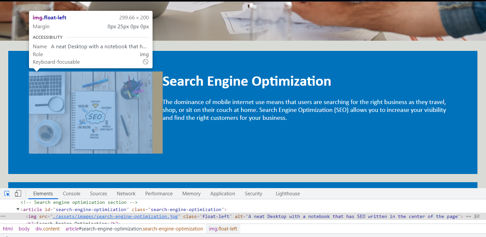

# Horiseon-Refactoring

## Description
The client has requested to refactor their site to meet accessibilty standards. Meeting the standards will optimized the site for search engines.

## Table of Contents

* [Installation](#installation)
* [Usage](#usage)
* [Credits](#credits)
* [License](#license)

## Installation

The project is viewable at the project's github pages.

URL of deployed application: https://armcuellar.github.io/horiseon-refactoring/

## Usage

Adding accessibilty would make the webpage accessible to people with disability through assistive tecnology.
Adding alternative text will allow assitive technology to describe the images in the webpage.

The webpage looks similar to original site with the exception of accessibility standards added.

## Credits

[Armando Cuellar](https://github.com/armcuellar) 

## License

Licencsed under [MIT License](LICENSE)
